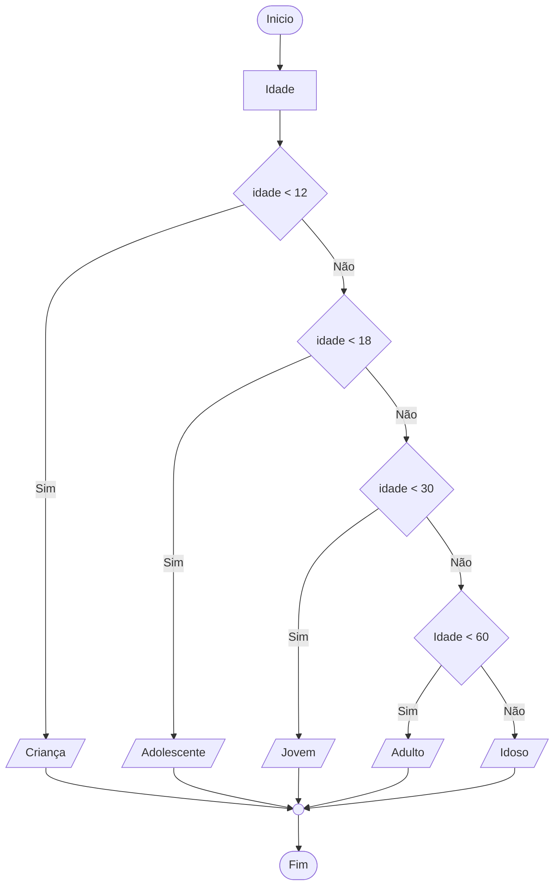

# Faixa etária

Programa que ler qualquer idade e retorna a faixa etária daquela idade.

## Fluxograma

```mermaid
  graph TB;
      A([Inicio]) --> B[Idade];
      B --> C{idade < 12};
      C -->|Sim| D[/Criança/];
      D --> L(( ))
      C -->|Não| E{idade < 18};
      E -->|Sim| F[/Adolescente/];
      F --> L
      E -->|Não| G{idade < 30};
      G -->|Sim| H[/Jovem/];
      H --> L
      G -->|Não| I{Idade < 60};
      I -->|Sim| J[/Adulto/];
      J --> L
      I -->|Não| K[/Idoso/];
      K --> L
      L --> N([Fim])
```
