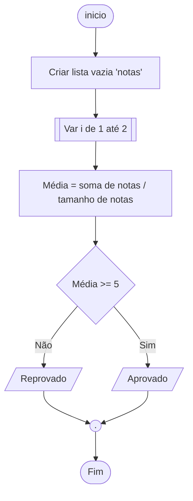

# Media de aluno

Programa que calcula a média de algum aluno e retorna sua situação.

## Situações:
- Aprovado (Média maior ou igual a 5)
- Reprovado (Média inferior a 5)

## Fluxograma

```mermaid
  graph TD;
      A([inicio]) --> B[Criar lista vazia 'notas'];
      B --> C[[Var i de 1 até 2]];
      C --> D[Média = soma de notas / tamanho de notas];
      D --> E{Média >= 5};
      E -->|Não| F[/Reprovado/];
      E -->|Sim| G[/Aprovado/];
      F --> H((.));
      G --> H;
      H --> I([Fim]);
```
