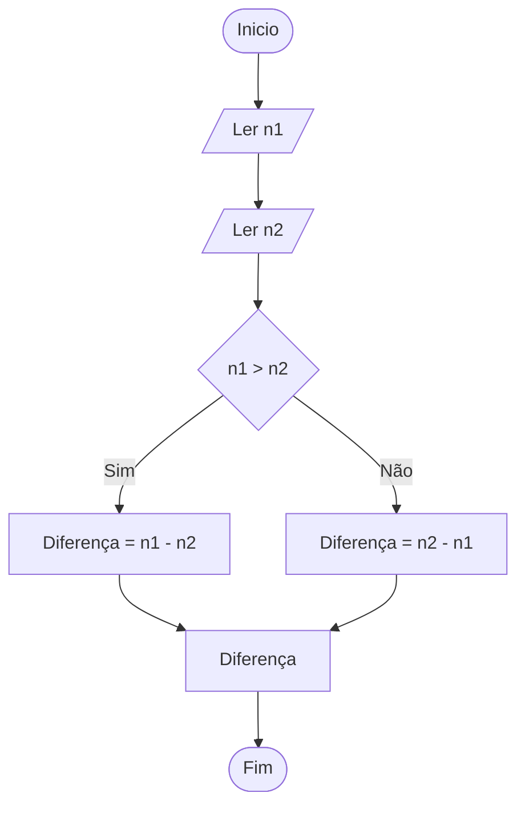

# Subtração pelo maior valor

Programa que ler 2 números, e subtrai do maior para o menor.

## Fluxograma

```mermaid
  graph TD;
      A([Inicio]) --> B[/Ler n1/];
      B --> C[/Ler n2/];
      C --> D{n1 > n2};
      D -->|Sim| E[Diferença = n1 - n2];
      D -->|Não| F[Diferença = n2 - n1];
      E --> G[Diferença];
      F --> G;
      G --> H([Fim])
```
